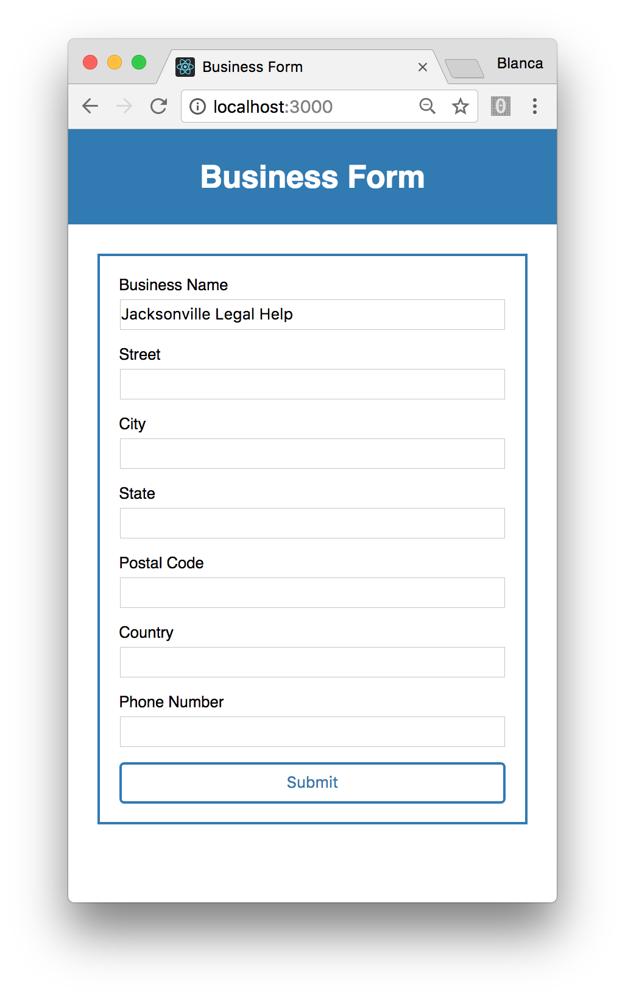
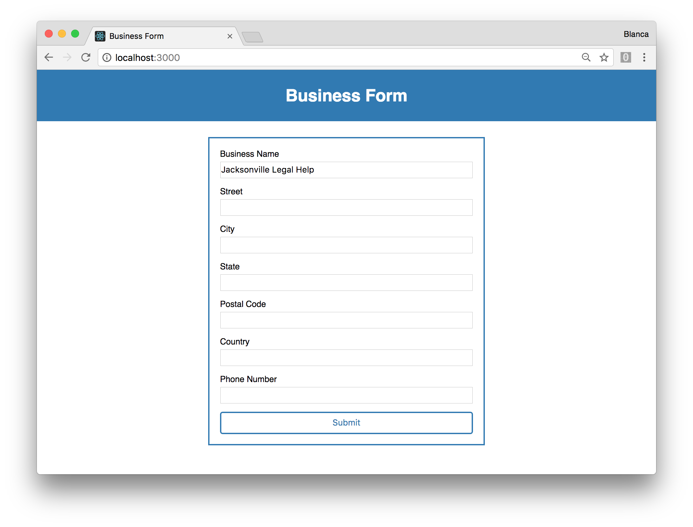

# Business Form

This app has a simple form to collect information from a user. It also allows for a modal to come up showing an iframe with a sample website.

## Functionality

As a user I can enter the following business details in a form

- Business Name
- Street
- City
- State (i.e. WA)
- Postal Code
- Country (i.e. US)
- Phone Number

As a user, I can submit the information by clicking a Submit button.

As a user, I can see a modal appearing on the screen.

As a user, I can see an iframe within the modal.

The Submit button will serialize the form's fields, and store them in a JSON object in the state of the app.




The Submit button will launch a modal window.

The iframe will be a URL generated that passes the string version of the JSON to render a preview Site. JSON string is passed as the "site" url param. clone_id will be static. [Example URL can be found here](http://cloudtemplates.cloudfrontend.net/app/live-preview/?clone_id=1576931&site={%22business%22:{%22business_name%22:%20%22Johnson%20Legal%20Partners%22}})

The modal window should have two buttons:
- Close - Closes the modal window to allow the user to edit their business fields again.
- Export - Will console.log the raw JSON object (not the "stringified" version).


## Technologies used

This app is built with [React](https://facebook.github.io/react/). I used [Create React App](https://github.com/facebookincubator/create-react-app) to get it started.

For testing I used [Jest](https://github.com/facebook/jest), and [Enzyme](http://airbnb.io/enzyme/docs/api/).

## Running

Clone this repo:

```
$ git clone https://github.com/groundberry/business-form
```

Install all dependancies:

```
$ npm install
```

Start the server:

```
$ npm start
```

## Testing

Run the tests:

```
$ npm run test
```

